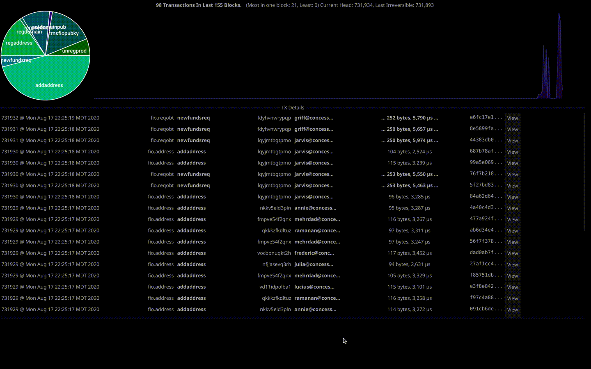

# fio-watch

A simple near-real-time (GUI) monitor of FIO transactions. It is *not* finished or ready for general use.

## Installing

1. [install](https://golang.org/dl/) Go v1.14 or later.
1. get the os-specific [dependencies to build](https://developer.fyne.io/started/) a Fyne application
1. run `go install github.com/blockpane/fiowatch/...`
1. launch with `~/go/bin/fio-watch -u http://nodeos.local:8888 -p2p nodeos.local:9876`

## Why is this special, what's the upside?

This tool uses the P2P protocol for getting the blocks / transactions instead of using the http API, which can overwhelm
a remote node. The upside to using P2P is that it is much faster, requires less resources and is less likely to miss
transactions vs fetching a block every 500ms via HTTP. It's still necessary to have a nodeos API available for getting LIB,
ABIs and so on, but shouldn't flood a node with API calls to keep up with the head.

## Known Issues - WIP

* Need ability to save connection settings.
* There is a resource leak that can consume a lot of memory after a few thousand transactions.
* More than a few dozen transactions / block can slow the app down.

## Other

* This was built with the very awesome [Fyne Toolkit](https://fyne.io), a pure-Go windowing toolkit.
* In theory this should be able to run on Mac, Linux, Windows, Android, and IOS. (Scaling issues need to be worked out.)

