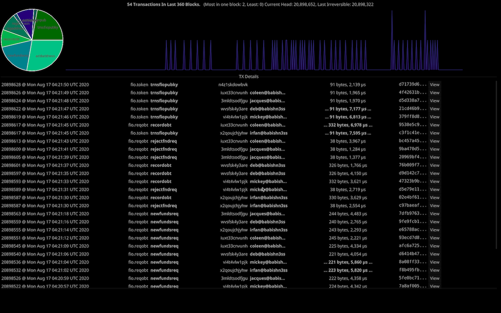

# fio-watch

Just a simple near-real-time (GUI) monitor of FIO transactions. Intended for use on something like a Raspberry Pi or Android
tablet for watching transactions. It is *not* finished or ready for use. This is pre-alpha quality. This has been split out
of an existing tool used for development testing, and still needs some cleanup to remove dead code.

Note also:

1. future planned ability is to use p2p not the http API, which will make this much more efficient.
1. This will overload a remote node, please only use locally!!!

